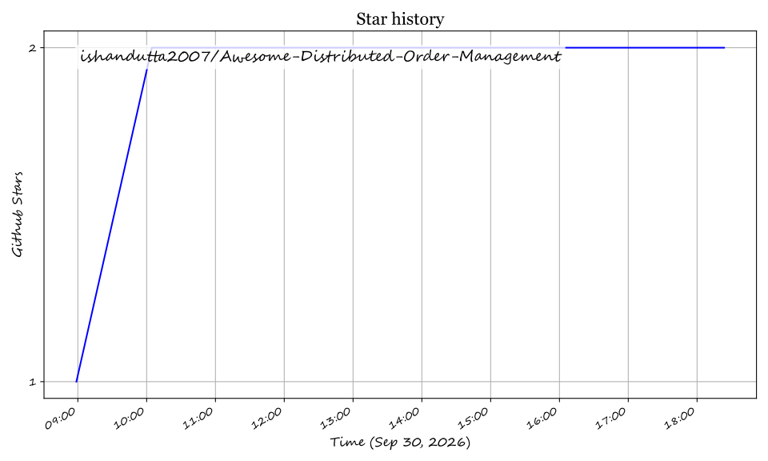

# Awesome Distributed Order Management (DOM) System 📦✨

  

  
  
  
  
  

---

## 📌 Top Distributed Order Management (DOM) Ecosystem & Architecture 🚀

**Curated List of SaaS Products & Open-Source GitHub Projects**  
*Focused on Omnichannel Order Orchestration, Intelligent Sourcing & Fulfillment Optimization*  

**Last updated: September 2026** 📅

This repository tracks notable **SaaS platforms** and **open-source projects** for **Distributed Order Management (DOM)**. These tools orchestrate order fulfillment across distributed inventory nodes — warehouses, stores, dark stores, and drop-ship partners — using real-time inventory visibility and optimization algorithms to decide what to promise, where to source from, and how to route orders for cost-effective, on-time delivery. 🚚💨

---

## 📑 Table of Contents
- [📊 Market Overview & Industry Trends](#-market-overview--industry-trends)
- [🏢 SaaS / Hosted DOM Platforms](#-saas--hosted-dom-platforms)
- [💻 Open-Source GitHub Projects](#-open-source-github-projects)
- [🤝 How to Contribute](#-how-to-contribute)
- [💖 Support & Sponsorship](#-support--sponsorship)
- [📈 Star History](#-star-history)
- [⚠️ Disclaimer](#%EF%B8%8F-disclaimer)

---

## 📊 Market Overview & Industry Trends 📈

> [!NOTE]
> The **Multichannel & Distributed Order Management (DOM) sector** is estimated at **$4.95 Billion in 2026** and projected to reach over **$11.3 Billion by 2034 (CAGR of ~10.5%)**. 
> 
> **Market Structure:** The industry is **moderately fragmented**, featuring a mix of legacy enterprise incumbents (IBM, Oracle, SAP, Salesforce) and agile cloud-native DOM specialists (Fluent Commerce, OneStock, Kibo). While top cloud suites capture enterprise volume, no single vendor holds a monopoly—making composable, API-first architecture key to modern retail fulfillment.

---

## 🏢 SaaS / Hosted DOM Platforms ☁️

Below is a detailed comparison of enterprise SaaS and hosted Distributed Order Management platforms, sorted by **Company Revenue / Scale (Descending)** 📉.

| Product Name 🏷️ | Company Revenue / Scale 💰 | Pricing Model 💳 | Free Tier / Trial Limit ⏳ | Description & Key Capabilities 💡 |
| :--- | :--- | :--- | :--- | :--- |
| **[IBM Sterling DOM](https://www.ibm.com/products/sterling-order-management)** | **~$67.5 Billion** (FY25 Total IBM Revenue) | Quote-based enterprise license (Starts ~$40,000/year base tier) | No self-service free trial; interactive demo sandbox on request | Enterprise-grade DOM platform for omnichannel fulfillment, real-time inventory visibility, and complex order routing. |
| **[Salesforce OMS](https://www.salesforce.com/)** | **~$37.9 Billion** (FY25 Total Salesforce Revenue) | ~0.25% to 1.0% of Gross Merchandise Value (GMV) | 30-day guided Salesforce trial environment | Order Management System integrated with Commerce Cloud, providing omnichannel inventory tracking and automated fulfillment flows. |
| **[SAP Order Management](https://www.sap.com/products/order-management.html)** | **~€36.8 Billion** (~$40B FY25 SAP Revenue) | Volume-based modular subscription (Starts ~$25,000/year) | 30-day SAP Business Technology Platform trial | Cloud-native composable OMS with Joule AI copilot, Order Reliability Agent, and low-code process customization. |
| **[Oracle DOM](https://www.oracle.com/)** | **~$53.0 Billion** (FY25 Total Oracle Revenue) | Tiered cloud subscription per order volume / GMV | 30-day Oracle Cloud Free Tier ($300 cloud credits) | Distributed order management within Oracle Retail & Fusion Cloud with predictive inventory optimization and carrier routing. |
| **[Magento OMS (Adobe)](https://business.adobe.com/products/magento/magento-commerce.html)** | **~$21.5 Billion** (FY25 Total Adobe Revenue) | Included with Commerce Cloud license (Starts ~$22,000/year) | 30-day Adobe Commerce demo sandbox | Order management extensions within Adobe Commerce for multi-store fulfillment, order splitting, and backorder management. |
| **[Manhattan Active Omni](https://www.manh.com/)** | **~$1.08 Billion** (FY25 Revenue) | Custom annual enterprise subscription | No public free trial; live demo upon sales qualification | Unified commerce platform featuring advanced DOM algorithms for store fulfillment, DC routing, and drop-ship execution. |
| **[Radial](https://www.radial.com/)** | **~$958 Million** (Annual Revenue; Bpost Subsidiary) | Custom quote-based (Combined 3PL + OMS fulfillment model) | No free trial; personalized consultation and fulfillment assessment | Omnichannel 3PL fulfillment and distributed order routing platform tailored for mid-market and enterprise retailers. |
| **[Kibo Commerce](https://kibocommerce.com/)** | **~$100 Million+** (Private; 30% YoY Growth) | Order volume / order line usage model (Starts ~$15,000/year) | 14-day preview portal access upon demo request | Composable B2C/B2B commerce and order management platform with intelligent inventory sourcing and store pickup support. |
| **[OneStock](https://www.onestock-retail.com/)** | **~$26 Million** ARR ($88M total funding) | Tiered ARR based on connected stores & order volume | No free trial; customized proof-of-concept (PoC) demo | Leading European DOM platform specializing in ship-from-store, delivery promise calculations, and order orchestration. |
| **[Fluent Commerce](https://fluentcommerce.com/)** | **~A$29.7 Million** ARR ($46M Bain Capital Round) | Tiered SaaS subscription (Fluent Light vs. Enterprise) | No self-service free trial; sandbox developer tenant for partners | Cloud-native, composable DOM platform focusing on real-time inventory consolidation and complex order routing. |

---

## 💻 Open-Source GitHub Projects 🔓

Below is a curated list of active open-source Distributed Order Management frameworks, ERP systems, and microservices reference implementations, sorted by **GitHub_Stars_Count (Descending)** ⭐.

| Repository / Project 📦 | Stars_Count 🌟 | Primary Tech Stack 🛠️ | Description & Key DOM Features 📝 |
| :--- | :--- | :--- | :--- |
| **[medusajs/medusa](https://github.com/medusajs/medusa/stargazers)** |  | Node.js, TypeScript, PostgreSQL | Open-source headless commerce platform with multi-warehouse inventory reservation, order routing plugins, and automated fulfillment workflows. |
| **[saleor/saleor](https://github.com/saleor/saleor/stargazers)** |  | Python, Django, GraphQL, Next.js | High-performance, headless GraphQL commerce engine with multi-channel stock allocation, order status state machines, and fulfillment tracking. |
| **[spree/spree](https://github.com/spree/spree/stargazers)** |  | Ruby on Rails, PostgreSQL | Open-source e-commerce ecosystem featuring stock location tracking, inventory unit reservations, multi-vendor drop-shipping, and split shipments. |
| **[shopware/shopware](https://github.com/shopware/shopware/stargazers)** |  | PHP, Symfony, Vue.js | Enterprise open-source commerce platform supporting multi-inventory rules, rule-based order routing, and B2B order orchestration. |
| **[vendure-ecommerce/vendure](https://github.com/vendure-ecommerce/vendure/stargazers)** |  | TypeScript, NestJS, GraphQL | Modern headless commerce framework supporting multi-stock allocation strategies, configurable order state machine, and custom fulfillment handlers. |
| **[apache/ofbiz](https://github.com/apache/ofbiz-framework/stargazers)** |  | Java, Apache Groovy, Gradle | Mature open-source ERP/OMS stack with real-time inventory visibility, strategic order routing, BOPIS/BORIS support, and warehouse management. |
| **[Paraselli/cloud-native-order-platform](https://github.com/Paraselli/cloud-native-order-platform/stargazers)** |  | Java, Spring Boot, Kafka, Redis, AWS | Event-driven cloud-native order platform demonstrating microservices architecture, JWT auth, Kafka event streaming, and AWS S3/SQS/SNS integrations. |
| **[AbhashK1/Distributed-Order-Management-System](https://github.com/AbhashK1/Distributed-Order-Management-System/stargazers)** |  | Spring Boot, Kafka, Redis, Streamlit | Event-driven microservices reference architecture implementing SAGA patterns, Kafka topic orchestration, atomic Redis stock locks, and real-time Streamlit UI. |
| **[StepanShushakov/delivery-system](https://github.com/StepanShushakov/delivery-system/stargazers)** |  | Go, Microservices, Kafka, PostgreSQL | Microservices order delivery pipeline implementing SAGA distributed transaction patterns with rollback state management across payment and inventory. |
| **[ecommerce-erp](https://developer.aliyun.com/article/1753673)** |  | ThinkPHP, Vue.js, MySQL, Redis | Cross-border open-source ERP with SKU mapping, multi-warehouse stock reservation (physical, virtual, FBA), and automated logistics label generation. |

---

## 🤝 How to Contribute 🛠️

Contributions are welcome! Help us keep this list up to date:

1. Fork this repository.
2. Edit `README.md` following the table formatting.
3. Ensure links are working and facts are verified.
4. Submit a Pull Request with a short summary of your changes.

Check out our curated meta-list at [Awesome-Awesome-Awesome](https://github.com/ishandutta2007/Awesome-Awesome-Awesome)! 🌟

---

## 💖 Support & Sponsorship 🙏

If you found this repository helpful for your supply chain design, retail tech research, or engineering project, please consider supporting!

- ⭐ **Star** this repository to spread visibility!
- 🔀 **Fork** and share with your team!
- ☕ **Buy me a coffee**: Sponsor the developer via [GitHub Sponsors](https://github.com/sponsors/ishandutta2007)

Thank you for supporting open-source logistics technology! 🚀

---

## 📈 Star History

---

## ⚠️ Disclaimer 🔒

- This is a **community-curated** repository for informational and architectural evaluation purposes.
- Distributed order management tools process sensitive customer, inventory, and transaction data. Production deployments require PCI-DSS compliance, GDPR/CCPA data protection, and robust auth mechanisms.
- Open-source reference architectures provide solid event-driven blueprints but require custom carrier integrations and optimization tuning before enterprise deployment.

## Star History

<a href="https://star-history.com/#ishandutta2007/Awesome-Distributed-Order-Management&Timeline" align="center">
  <picture>
    <source media="(prefers-color-scheme: dark)" srcset="assets/ishandutta2007_Awesome-Distributed-Order-Management_growth.svg">
    
  </picture>
</a>
